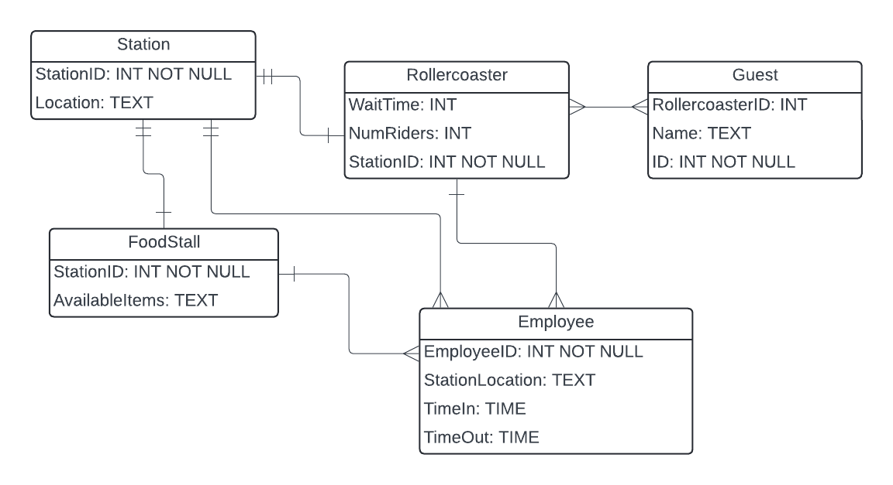

# nl-sql
Natural Language SQL Project by Keanna and Sofia

## Database Description:
Our database holds information about the operation of an amusement park, keeping track of the rollercoasters, food stands, employees, and guests.

## Schema


## Sample Question (Successful)
Here's an example of a question-query-response that worked well. Here, ChatGPT successfully creates a table join and clearly interprets the value.

*Question*: What is the location of food stall 1?

*Query*:
```sql
SELECT s.Location
FROM FoodStall fs
JOIN Station s ON fs.StationID = s.StationID
WHERE fs.StationID = 1;
```

*Response*: The location of food stall 1 is 3 Rollercoaster Rd.

## Sample Question (Unsuccessful)
Here's an example of a question-query-response that did not work. In this example, a foreign key describing the relationship is not specified in the schema, and gpt struggles to infer that relationship correctly.

*Question*: 
How many employees work at a food stall?

*Generated Query*:
```sql
SELECT COUNT(DISTINCT e.EmployeeID) AS NumberOfEmployees
FROM Employee e
JOIN FoodStall f ON e.StationLocation = f.StationID;
```

*Response*:
The query failed because it tried comparing a (text) location to an (integer) ID, which was an invalid comparison, generating the error: `Query failed. operator does not exist: text = integer
LINE 4: JOIN FoodStall F ON E.StationLocation = F.StationID;`.

## Other Examples

Example 1.
> *Question*: What are all of the employees ids?
>
> *Query*:
> ```sql
> SELECT EmployeeID FROM Employee;
> ```
> 
> *Response*: Based on the provided data from the database, the employee IDs are:
>
> - 1
> - 2
>
> Therefore, the answer to your question is: The employee IDs are 1 and 2.

Example 2.
> *Question*: When did employee 2 start work?
> 
> *Query*:
> ```sql
> SELECT TimeIn 
> FROM Employee 
> WHERE EmployeeID = 2;
> ```
> 
> *Response*:  Based on the provided data, there is no explicit information regarding when employee 2 started work. The column labeled "timein" contains a time value of `12:00 PM`, but it does not specify a date or indicate whether this time corresponds to the employee's start time on their first day of work.   
> Without additional context or data indicating a starting date or day for employee 2, it is not possible to determine when they started work.

Example 3. 
> *Question*: How many people are at each roller coaster?
> 
> *Query*:
> ```sql
> SELECT 
>     rc.StationID AS RollercoasterID, 
>    COUNT(g.ID) AS NumberOfGuests
> FROM 
>    Rollercoaster rc
>LEFT JOIN 
>    Guest g ON rc.StationID = g.RollercoasterID
>GROUP BY 
>    rc.StationID;
> ```
> 
> *Response*: Based on the provided data from your database, here is the count of people at each roller coaster:
>
> - Roller Coaster ID 4: 3 guests
> - Roller Coaster ID 3: 2 guests

Example 4. 
> *Question*: What are the names of the people who have ridden rollercoaster 3?
> 
> *Query*:
> ```sql
> SELECT Name
> FROM Guest
> WHERE RollercoasterID = 3;
> ```
> 
> *Response*: The names of the people who have ridden rollercoaster 3 are Maria Rodriguez and Joe Marion.

Example 5. 
> *Question*: What is the wait time for rollercoaster 4?
> 
> *Query*:
> ```sql
> SELECT WaitTime 
> FROM Rollercoaster 
> WHERE StationID = 4;
> ```
> 
> *Response*: The wait time for rollercoaster 4 is 27 minutes.

Example 6. 
> *Question*: How many rollercoasters are there?
> 
> *Query*:
> ```sql
> SELECT COUNT(*) FROM Rollercoaster;
> ```
> 
> *Response*: Based on the data provided from your database, there are **2 rollercoasters**.

## Prompting Strategies
We tried to query the database using the zero shot technique and single-domain technique. For 7 of the 8 queries, the answer that was provided was the same using either method. However for the query on how many employees work at a food stall, the query where an example was provided gave the correct answer of 2, while the zero-shot query made an invalid comparison and returned that there were no employees working at a food stall. 
