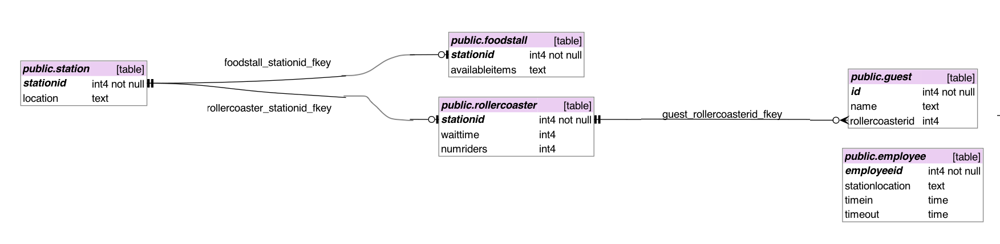

# nl-sql
Natural Language SQL Project by Keanna and Sofia

## Database Description:
Our database holds information about the operation of an amusement park, keeping track of the rollercoasters, food stands, employees, and guests.

## Schema

## Sample Question (Successful)
[*Sample question, SQL query, response that worked (if you have one)*]

## Sample Question (Unsuccessful)
[*Sample question, SQL query, response that did not work (if you have one)*]

## Other Examples
[*A file outlining at least 6 other examples.*]

## Prompting Strategies
[*Describe somewhere which prompting strategies you tried and if you noticed a difference between them. (Note my post only does two of three - which is fine!).*]

